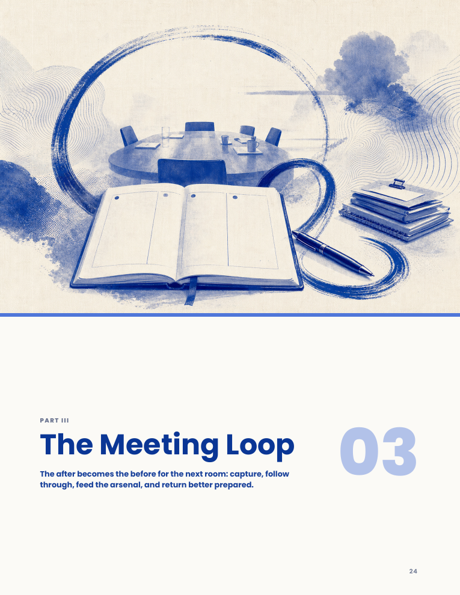
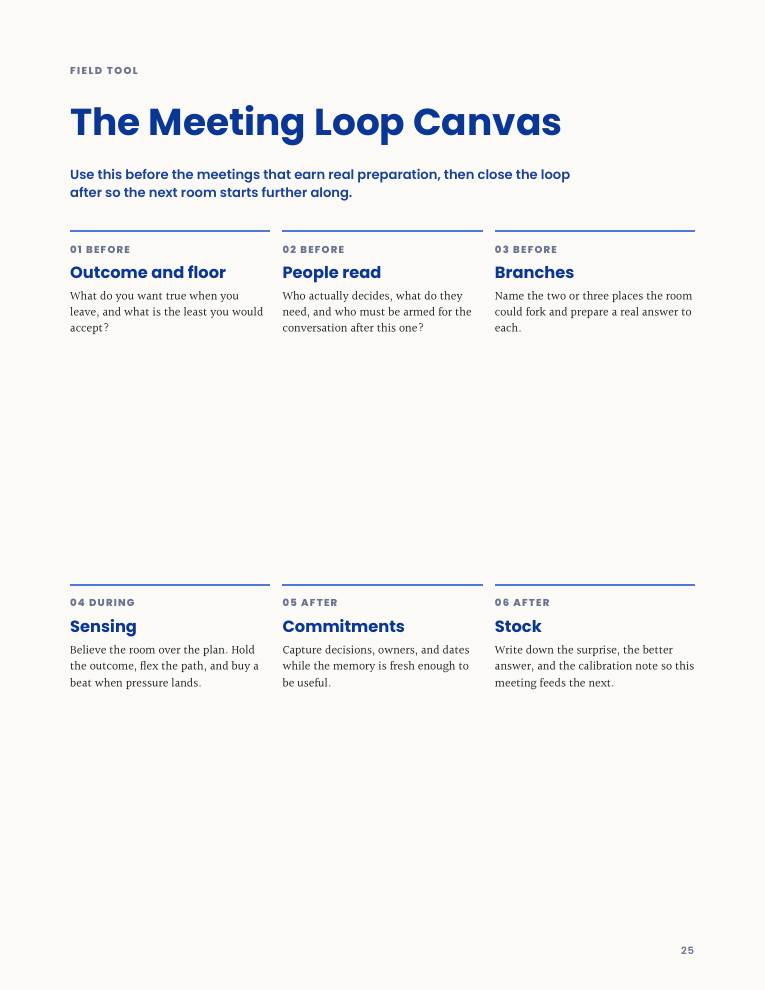
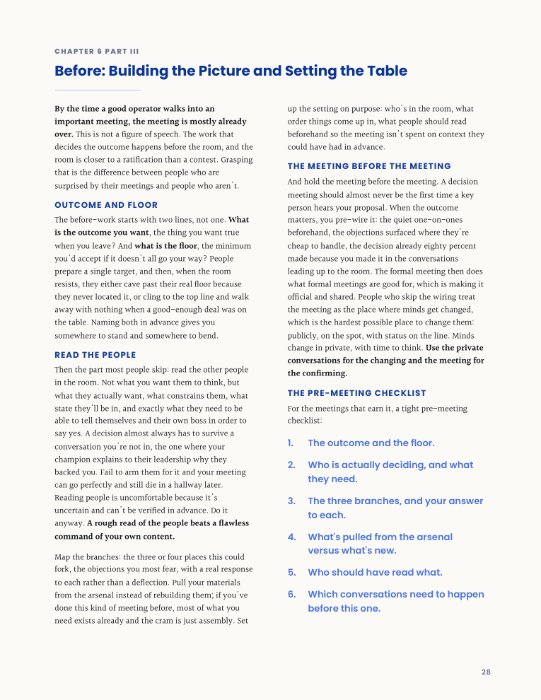

# Frontend Textbooks

A coding-agent skill for turning manuscripts, field guides, manuals, and long-form notes into designed HTML books and print-ready PDFs. It is packaged as a standalone skill: agents can start from `SKILL.md`, load the referenced support files, generate the HTML book, verify the rendered pages, and export a Letter-size PDF.

## What This Does

**Frontend Textbooks** helps coding agents create book-like artifacts instead of dumping prose into a web page. It uses an HTML-first workflow: the editable source of truth is a browser-readable `index.html`, and the final PDF is exported from that same HTML after layout verification.

The skill is built for textbook, manual, field-guide, executive briefing, and coffee-table-style books where typography, pacing, page rhythm, diagrams, covers, and print integrity matter.

### Key Features

- **Print-Ready PDF Output** - Exports US Letter PDFs with page-safe CSS, printed backgrounds, and fixed-format designed pages.
- **HTML First** - Produces a browser-readable HTML book before exporting the PDF, so the artifact stays inspectable and editable.
- **Manuscript Preservation** - Defaults to preserving at least 90% of the source text instead of summarizing chapters away.
- **Designed Book Rhythm** - Supports covers, title pages, tables of contents, part dividers, two-column reading pages, visual plates, model cards, diagrams, and chapter closers.
- **Coffee-Table Feel When Appropriate** - Encourages image-led section dividers, spacious editorial pages, generated artwork, and strong cover routes when the manuscript calls for a more collectible book.
- **Reusable Scaffold** - Includes a Markdown-to-book scaffold with cover options, browser-side pagination, chapter-close furniture, generated part images, mobile collapse behavior, and overflow assertions.
- **Verification Scripts** - Provides Playwright-backed rendered-state checks for page count, text-frame overflow, tail-furniture overlap, screenshots, and readiness-gated PDF export.

## Example Output

These pages were rendered from an example PDF generated with the skill. The same workflow can produce textbook-style manuals, editorial field guides, and coffee-table-style books with image-led section pacing.

<p>
  
  
  
  
</p>

## Why Codex Is Recommended

Codex is highly recommended for this skill because it can combine file editing, shell scripts, browser/PDF verification, and image generation in one workflow. That matters for book production: the best results often need generated cover art, section-divider images, visual plates, and manuscript-grounded editorial illustrations, then a rendered PDF pass to confirm those assets actually print cleanly.

## Installation

### Codex Manual Installation

Clone this repository into your Codex skills directory:

```bash
git clone https://github.com/onepixelaway/frontend-textbooks.git ~/.codex/skills/frontend-textbooks
```

Then ask Codex to use the `frontend-textbooks` skill when you want to turn manuscript text into a designed book and PDF.

### Claude Code Manual Installation

Copy or clone the skill into Claude Code's skills directory:

```bash
git clone https://github.com/onepixelaway/frontend-textbooks.git ~/.claude/skills/frontend-textbooks
```

Then use it as a standalone skill by asking Claude Code to use `frontend-textbooks`.

### Other Coding Agents

Other local coding assistants can use the same core skill if they can read files and run shell commands. Point the agent at this repository and ask it to start from:

```text
SKILL.md
```

The skill file tells the agent when to load:

- `STYLE_PRESETS.md`
- `page-base.css`
- `html-template.md`
- `animation-patterns.md`
- `references/pdf-optimization.md`
- `scripts/`

## Usage

### Create a New Textbook or Field Guide

```text
Use the frontend-textbooks skill to turn this manuscript into a print-ready PDF book.
```

The skill will:

1. Locate or ingest the manuscript.
2. Infer a book structure that preserves the source text.
3. Plan covers, chapter rhythm, diagrams, generated images, and interior tools.
4. Generate a designed HTML book.
5. Export a PDF from the same HTML.
6. Verify page integrity, overflow, text preservation, generated assets, and mobile readability.

## Included Styles

The default style is a cobalt editorial system:

- Poppins for headings and labels
- Halant for body copy
- Deep cobalt hierarchy with lighter cobalt-blue accents
- Warm paper background
- Two-column editorial reading pages
- Solid-band split cover support for generated or supplied artwork

Additional presets in `STYLE_PRESETS.md` include scholarly, field-guide, technical, literary, editorial journal, and product-manual directions. They are starting points, not cages.

## Repository Contents

```text
frontend-textbooks/
  SKILL.md
  STYLE_PRESETS.md
  page-base.css
  html-template.md
  animation-patterns.md
  references/
    pdf-optimization.md
  scripts/
    build-html-book.mjs
    export-pdf.sh
    export-ready-pdf.sh
    verify-html-book.sh
    verify-rendered-book.sh
    inspect-pdf.sh
    deploy.sh
```

## Design Philosophy

Frontend Textbooks treats books as designed systems:

- Preserve the manuscript.
- Let HTML be the editable source.
- Verify the PDF, not just the browser.
- Make covers sell the book.
- Make diagrams explain before they decorate.
- Own whitespace.
- Avoid generic AI visual habits.
- Use generated images only when they add clarity, pacing, atmosphere, or book-like richness.

## Credits

Inspired by [Zara Zhang's `frontend-slides`](https://github.com/zarazhangrui/frontend-slides), especially the skill-first packaging idea, HTML-first artifact workflow, installation structure, and README organization. Thank you, Zara.

## License

This project is available under the MIT License.
