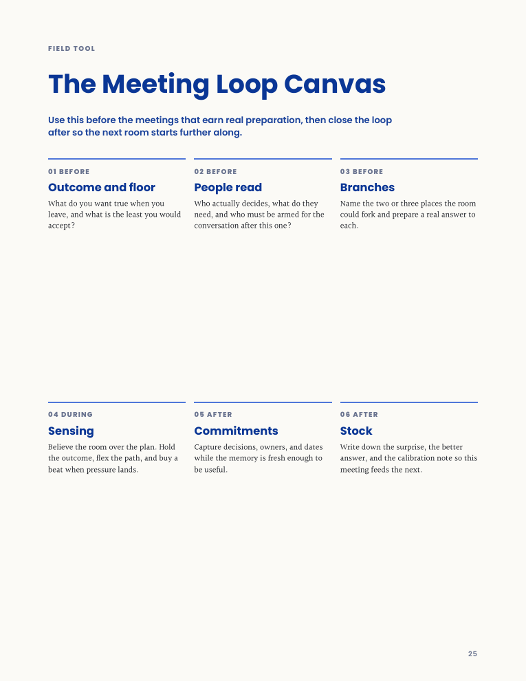
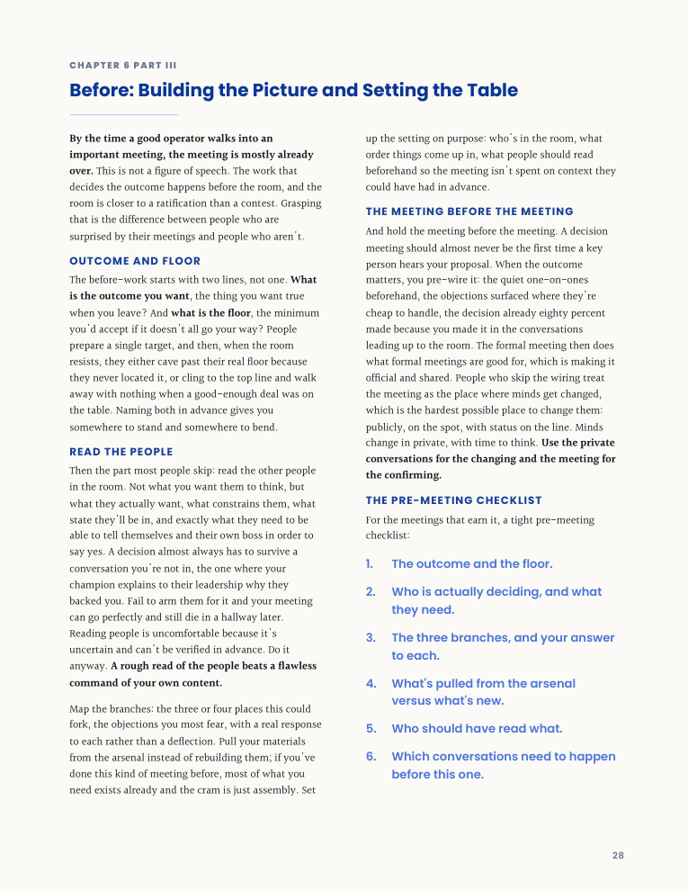

# Frontend Textbooks

A coding-agent skill for turning manuscripts, field guides, manuals, and long-form notes into designed HTML books and print-ready PDFs. It is packaged as a standalone skill: agents can start from `SKILL.md`, load the referenced support files, generate the HTML book, verify the rendered pages, and export a Letter-size PDF.

## What This Does

**Frontend Textbooks** helps coding agents create book-like artifacts instead of dumping prose into a web page. It uses an HTML-first workflow: the editable source of truth is a browser-readable `index.html`, and the final PDF is exported from that same HTML after layout verification.

The skill is built for textbook, manual, field-guide, executive briefing, and coffee-table-style books where typography, pacing, page rhythm, diagrams, covers, and print integrity matter.

### Key Features

- **Print-Ready PDF Output** - Exports US Letter PDFs with page-safe CSS, printed backgrounds, and fixed-format designed pages.
- **HTML First** - Produces a browser-readable HTML book before exporting the PDF, so the artifact stays inspectable and editable.
- **Enforced Manuscript Preservation** - Tracks stable source blocks and fails verification below 90% coverage instead of merely estimating preservation.
- **Original Cover Artwork on Every Run** - Requires a unique manuscript-grounded local bitmap, binds it to the active theme prompt and manuscript hash, and fails closed instead of falling back to a typographic cover.
- **Designed Book Rhythm** - Supports covers, title pages, tables of contents, part dividers, two-column reading pages, visual plates, model cards, diagrams, and chapter closers.
- **Coffee-Table Feel When Appropriate** - Encourages image-led section dividers, spacious editorial pages, generated artwork, and strong cover routes when the manuscript calls for a more collectible book.
- **Reusable Scaffold** - Includes a Markdown-to-book scaffold with cover options, browser-side pagination, chapter-close furniture, generated part images, mobile collapse behavior, and overflow assertions.
- **Verification Scripts** - Provides Playwright-backed checks for readiness, allowlisted assets, source coverage, desktop/mobile overflow, every rendered page, and final PDF structure.
- **Deterministic Pipeline** - One versioned command surface validates strict JSON contracts, caches content-addressed work, emits machine-readable diagnostics, and writes a final hash manifest.
- **Model/Script Boundary** - Scripts own parsing and production mechanics; the model supplies compact plans, targeted repair decisions, exceptions, and aesthetic approval through schemas.
- **Tiered Verification** - Fast builds avoid a browser, affected checks render changed source pages plus mobile, and full finalization verifies desktop/print/mobile and exports the PDF in one browser session.
- **Compact Evidence** - Successful commands print a one-line summary while full reports, source accounting, screenshots, and ordered contact sheets remain on disk.

## Example Output

These pages were rendered from an example PDF generated with the skill. The same workflow can produce textbook-style manuals, editorial field guides, and coffee-table-style books with image-led section pacing.

<p>
  
  
  
  
</p>

## Why Codex Is Recommended

Codex is highly recommended for this skill because it can combine file editing, shell scripts, browser/PDF verification, and image generation in one workflow. That matters for book production: the best results often need generated cover art, section-divider images, visual plates, and manuscript-grounded editorial illustrations, then a rendered PDF pass to confirm those assets actually print cleanly.

## Installation

### Codex Manual Installation

Clone this repository into your Codex skills directory:

```bash
git clone https://github.com/onepixelaway/frontend-textbooks.git ~/.codex/skills/frontend-textbooks
cd ~/.codex/skills/frontend-textbooks
npm ci
npm run setup:browsers
```

Then ask Codex to use the `frontend-textbooks` skill when you want to turn manuscript text into a designed book and PDF.

### Claude Code Manual Installation

Copy or clone the skill into Claude Code's skills directory:

```bash
git clone https://github.com/onepixelaway/frontend-textbooks.git ~/.claude/skills/frontend-textbooks
cd ~/.claude/skills/frontend-textbooks
npm ci
npm run setup:browsers
```

Then use it as a standalone skill by asking Claude Code to use `frontend-textbooks`.

### Other Coding Agents

Other local coding assistants can use the same core skill if they can read files and run shell commands. Point the agent at this repository and ask it to start from:

```text
SKILL.md
```

The skill file routes the agent to optional references only when needed:

- `references/intake-and-planning.md`
- `references/visual-system.md`
- `references/layout-and-html.md`
- `references/verification-gates.md`
- `references/reasoning-contracts.md`
- `references/iteration.md`

`STYLE_PRESETS.md`, `page-base.css`, `html-template.md`, and browser internals are not default reads; agents open them only when changing the corresponding implementation.

Bundled commands resolve from the installed skill directory, so book inputs and outputs can remain in any workspace. Relative config paths resolve from `book.json`, not the shell working directory. Runtime packages are pinned in `package-lock.json`; the browser runner reuses installed or cached browsers first and installs into a persistent cache only as a logged final fallback.

## Usage

### Create a New Textbook or Field Guide

```text
Use the frontend-textbooks skill to turn this manuscript into a print-ready PDF book.
```

The skill will:

1. Locate or ingest the manuscript.
2. Infer a book structure that preserves the source text.
3. Plan the cover subject, chapter rhythm, structured diagrams, generated images, and interior tools.
4. Generate and record a unique manuscript-grounded cover bitmap using the active theme's canonical prompt.
5. Generate a designed HTML book.
6. Export a PDF from the same HTML.
7. Verify page integrity, overflow, ordered text preservation, generated assets, cover evidence, and mobile readability.

The public command surface is `scripts/book-pipeline.mjs`:

```bash
# Generate stable source IDs for the model-authored plan.
node scripts/book-pipeline.mjs inventory --config book.json --manuscript manuscript.md

# Compile the canonical cover request, generate its target with an image tool,
# then bind that exact bitmap to this manuscript and plan.
node scripts/prepare-cover-image.mjs book.json manuscript.md book-plan.json
node scripts/record-cover-image.mjs book.json manuscript.md book-plan.json

# Deterministic build checks, without Chromium.
node scripts/book-pipeline.mjs build --config book.json --manuscript manuscript.md --plan book-plan.json --tier fast

# Changed-page desktop/mobile verification, without PDF export.
node scripts/book-pipeline.mjs verify --config book.json --manuscript manuscript.md --plan book-plan.json --tier affected

# Full rendered verification, ordered contact sheets, PDF export, and artifact manifest.
node scripts/book-pipeline.mjs finalize --config book.json --manuscript manuscript.md --plan book-plan.json --tier full
```

If the plan requires aesthetic review, the first full run returns `review-required`. Inspect every contact sheet, write schema-valid `aesthetic-review.json`, and rerun with `--aesthetic-review aesthetic-review.json`; unchanged rendering and PDF work are reused.

Pipeline stdout is always one compact JSON object, including failures. Full evidence remains on disk; `render-report.json` uses `schemaVersion: 2` and reports only failed or partial source blocks instead of a successful per-block inventory.

## Included Styles

The default style is the `colbalt` theme, a cobalt editorial system defined in `themes/colbalt`:

- Poppins-compatible local fallbacks for headings and labels by default
- Halant-compatible local serif fallbacks for body copy by default
- Deep cobalt hierarchy with lighter cobalt-blue accents
- Warm paper background
- Two-column editorial reading pages
- Solid-band split cover support for generated or supplied artwork

The scaffold also includes an `alumni` theme inspired by a warm single-ink editorial system: Bricolage Grotesque display type, Fraunces body copy, rust terracotta ink, and cream paper.

Additional presets in `STYLE_PRESETS.md` include scholarly, field-guide, technical, literary, editorial journal, and product-manual directions. To make a preset available to the scaffold, add it as a module under `themes/` and register it in `themes/index.mjs`.

## Repository Contents

```text
frontend-textbooks/
  SKILL.md
  STYLE_PRESETS.md
  page-base.css
  html-template.md
  animation-patterns.md
  package.json
  package-lock.json
  .github/workflows/ci.yml
  references/
    intake-and-planning.md
    iteration.md
    layout-and-html.md
    pdf-optimization.md
    reasoning-contracts.md
    verification-gates.md
    visual-system.md
  schemas/
    book-config.schema.json
    book-plan.schema.json
    diagnostics.schema.json
    repair-actions.schema.json
    repair-tasks.schema.json
    aesthetic-review.schema.json
    artifact-manifest.schema.json
  themes/
    alumni/
      index.mjs
    colbalt/
      index.mjs
    index.mjs
  scripts/
    book-pipeline.mjs
    book-contract.mjs
    build-html-book.mjs
    prepare-cover-image.mjs
    record-cover-image.mjs
    book-browser.mjs
    export-pdf.sh
    export-ready-pdf.sh
    export-local-chrome.sh
    verify-html-book.sh
    verify-rendered-book.sh
    inspect-pdf.sh
    run-book-browser.sh
    create-contact-sheet.mjs
    pdf-inspection.mjs
  tests/
```

## Design Philosophy

Frontend Textbooks treats books as designed systems:

- Preserve the manuscript.
- Let HTML be the editable source.
- Verify the PDF, not just the browser.
- Keep publishing and hosting provider choices outside the book-production toolchain.
- Make covers sell the book.
- Make diagrams explain before they decorate.
- Own whitespace.
- Avoid generic AI visual habits.
- Generate a unique manuscript-grounded cover image every time; use additional generated images when they add clarity, pacing, atmosphere, or book-like richness.

## Migration to Plan v2

Existing projects without original cover art now fail closed. Add a new local `coverImage` target to `book.json`, migrate `book-plan.json` to version 2 with a complete `visuals.cover` decision, run `prepare-cover-image.mjs`, generate the exact requested bitmap, and run `record-cover-image.mjs`. Depending on the first missing contract, the pipeline reports `coverImage is required`, `COVER_DECISION_REQUIRED`, `COVER_TARGET_OCCUPIED`, `COVER_REQUEST_MISSING`, `COVER_ASSET_MISSING`, or `COVER_GENERATION_RECEIPT_MISSING`. An occupied target is accepted only when its exact current request, receipt, and bytes already match; otherwise move/remove the legacy asset or choose a new path. There is no waiver for legacy type-only covers.

## Credits

Inspired by [Zara Zhang's `frontend-slides`](https://github.com/zarazhangrui/frontend-slides), especially the skill-first packaging idea, HTML-first artifact workflow, installation structure, and README organization. Thank you, Zara.

## License

This project is available under the MIT License.
